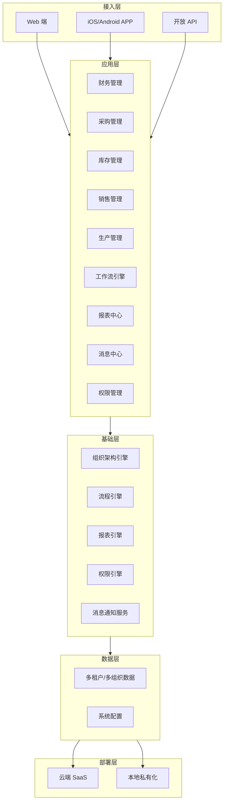

# 通用 ERP 系统建设方案

## 1. 客户现状与需求

### 1.1 项目概览表

| 项目 | 内容 |
|------|------|
| 项目名称 | 通用 ERP 系统建设 |
| 客户类型 | 通用制造/商贸企业 |
| 行业 | 制造业 > 通用制造业 / 商贸业 |
| 规模 | 中小型企业（100-2000人） |
| 项目类型 | 新建 |
| 核心目标 | 建立统一的企业资源管理平台，实现财务、采购、库存、销售、生产五大模块的协同管理，支持多组织架构和移动端应用 |
| 触发事件 | 业务规模扩张，现有系统无法支撑多组织统一管控 |

### 1.2 客户概况

- **公司定位**：通用制造/商贸企业，主营业务覆盖制造加工与商贸流通领域
- **商业模式**：B2B 为主，客户结构以企业客户为主体
- **数字化阶段**：信息化初期或系统升级阶段
- **组织形态**：集团下多个子公司或事业部，需支持独立核算

### 1.3 当前现状与挑战

1. **系统分散**：财务、采购、库存、销售、生产等业务分别使用不同系统或手工台账，数据孤岛严重
2. **多组织管控难**：各子公司/事业部独立运营，集团层面缺乏统一的财务管控和业务视图
3. **审批效率低**：大量审批流程依赖线下或邮件流转，响应慢、追溯难
4. **数据口径不统一**：各业务单元报表格式和统计口径各异，集团汇总耗时且易出错
5. **移动化能力缺失**：管理层和业务人员出差频繁，迫切需要移动端支持审批和查询
6. **扩展性不足**：现有系统难以支撑业务快速增长和个性化需求

### 1.4 核心需求清单

**P0 优先级（必须满足）**

| 序号 | 模块 | 功能点 |
|------|------|--------|
| P0-01 | 财务管理 | 总账、应收应付、固定资产、成本核算 |
| P0-02 | 采购管理 | 供应商管理、采购订单、入库、发票匹配 |
| P0-03 | 库存管理 | 多仓库管理、批次管理、库存预警 |
| P0-04 | 销售管理 | 客户管理、销售订单、发货、收入确认 |
| P0-05 | 生产管理 | BOM、工艺路线、工单管理、车间执行 |
| P0-06 | 基础能力 | 权限管理与角色控制、工作流引擎与审批流 |
| P0-07 | 部署模式 | 支持云端部署（SaaS）与本地部署（私有化） |
| P0-08 | 组织架构 | 多组织架构支持，集团-子公司/事业部多层级，独立核算与内部交易 |
| P0-09 | 移动端 | 移动端 APP（iOS/Android），支持审批、库存查询、移动报表 |

**P1 优先级（重要）**

| 序号 | 模块 | 功能点 |
|------|------|--------|
| P1-01 | 数据安全 | 组织级数据隔离、字段级敏感数据保护、操作审计日志 |
| P1-02 | 分析能力 | 报表中心与经营分析、消息通知中心 |

**P2 优先级（增强）**

| 序号 | 模块 | 功能点 |
|------|------|--------|
| P2-01 | 生态扩展 | API 开放平台，支撑与第三方系统对接 |

### 1.5 约束条件

| 约束类型 | 说明 |
|----------|------|
| 预算 | 待确认（参考范围：中小型企业 30-150 万元） |
| 实施周期 | 待确认（建议 3-6 个月分阶段上线） |
| 技术约束 | 无特定要求，可推荐主流技术栈 |
| 资源约束 | 客户需配备 IT 人员和业务骨干全程参与 |
| 现有系统 | 待确认（系统现状和新旧切换策略需进一步调研） |

---

## 2. 解决方案

### 2.1 整体思路

以「统一平台、分步落地、多组织协同」为核心理念，为客户构建覆盖财务、采购、库存、销售、生产全链路的 ERP 平台。

- **统一平台**：基于一体化架构设计，打通五大核心业务模块，消除数据孤岛
- **分步落地**：按模块优先级分阶段上线，P0 模块先行，快速交付业务价值
- **多组织协同**：通过组织隔离与数据权限机制，支撑集团化管控与子公司独立运营并存
- **移动优先**：内置移动端能力，确保管理层随时随地完成审批与决策

### 2.2 方案架构



### 2.3 功能设计

#### 2.3.1 财务管理模块（P0）

- **总账管理**：支持多币种、多账簿，总账凭证自动生成与手工录入并行
- **应收应付**：客户/供应商往来管理，自动账龄分析，支持预收预付和核销
- **固定资产**：资产卡片管理，自动计提折旧，支持资产调拨与清理
- **成本核算**：支持标准成本和实际成本两种核算模式，与生产模块联动

#### 2.3.2 采购管理模块（P0）

- **供应商管理**：供应商档案、资质管理、绩效评估与分级
- **采购需求**：MRP 运算结果自动生成采购需求，支持手工申请
- **采购订单**：订单全生命周期管理，支持到货跟踪和变更
- **入库与发票匹配**：到货入库、质检与发票三单匹配，自动核销

#### 2.3.3 库存管理模块（P0）

- **多仓库管理**：支持多仓库、多库位设置，仓库之间调拨
- **批次管理**：批次号全程追溯，保质期管理，支持先进先出
- **库存预警**：最低库存、最高库存、呆滞料预警，自动触发补货提醒
- **盘点管理**：定期盘点、抽盘支持，盘点差异处理

#### 2.3.4 销售管理模块（P0）

- **客户管理**：客户档案、分类分级、信用额度管理
- **销售订单**：订单录入、变更、拆分，支持分期发货和部分收款
- **发货管理**：发货计划、物流跟踪、签收确认
- **收入确认**：按发货/收款的收入确认，支持收入与发票关联

#### 2.3.5 生产管理模块（P0）

- **BOM 管理**：多层物料清单，支持替代料和 BOM 版本管理
- **工艺路线**：工序定义、工时定额、工艺参数管理
- **工单管理**：工单下达、领料、报工、完工全流程
- **车间执行**：工单派工、报工、移动端车间作业支持

#### 2.3.6 多组织架构（P0）

- **组织模型**：集团-子公司/事业部-部门多层级组织架构
- **独立核算**：各组织独立账簿、利润中心，支持内部交易和内部结算
- **统一报表**：集团层面自动汇总合并报表，数据权限按组织隔离

#### 2.3.7 移动端（P0）

- **移动审批**：采购订单、销售订单、付款申请等核心流程移动审批
- **库存查询**：扫码查询库存、批次、库位信息
- **移动报表**：经营看板、关键指标移动端可视化

#### 2.3.8 权限管理与工作流（P0）

- **角色权限**：基于 RBAC 的功能权限、数据权限双重控制
- **工作流引擎**：可视化流程设计器，支持条件分支、会签、加签
- **组织权限**：数据权限按组织架构隔离，集团可查看子公司数据

#### 2.3.9 数据安全（P1）

- **组织级数据隔离**：多组织架构下，各子公司数据物理或逻辑隔离，仅授权人员可见
- **敏感数据保护**：客户财务数据、价格策略等敏感字段支持加密存储或脱敏展示
- **操作审计日志**：核心业务操作（凭证录入、订单审批、权限变更等）全程记录，支持追溯

#### 2.3.10 报表中心（P1）

- **经营分析**：收入分析、成本分析、库存周转、资金流分析
- **自定义报表**：拖拽式报表设计器，支持多维度穿透
- **定时推送**：关键指标定时生成并推送至相关人员

#### 2.3.11 消息通知中心（P1）

- **多渠道通知**：站内信、邮件、APP 推送
- **待办中心**：统一待办入口，所有审批和待办任务聚合展示

#### 2.3.12 API 开放平台（P2）

- **标准 API**：RESTful API，覆盖主数据、订单、库存等核心接口
- **API 管理**：接口文档、调用授权、流量控制与日志监控
- **Webhook**：支持事件驱动的 Webhook 回调机制

### 2.4 技术方案

#### 部署架构

| 部署模式 | 适用场景 | 说明 |
|----------|----------|------|
| SaaS 云端部署 | 快速上线、成本优先、无专职 IT 团队 | 按年订阅，无需自建基础设施 |
| 私有化部署 | 数据安全要求高、有定制化需求 | 部署在客户机房或私有云，支持定制开发；注意：私有化部署可能超出 30-150 万基础预算范围 |

#### 预算说明

| 费用项 | 区间说明 |
|--------|----------|
| SaaS 订阅（年费） | 约 15-60 万/年，视用户数和模块数 |
| 私有化一次性实施 | 约 50-200 万，含实施服务和定制开发 |
| 实施服务费 | 通常为软件费用的 0.5-1.5 倍，视定制深度和范围 |
| 培训与上线支持 | 包含在实施服务内，或单独计费 5-15 万 |

> 注：30-150 万预算可覆盖 SaaS 模式全模块，或私有化模式下的标准化实施；如含深度定制开发或对接多个遗留系统，建议预算上浮至 100 万以上。

#### 推荐技术栈

| 层级 | 技术方向 | 说明 |
|------|----------|------|
| 前端 | Vue.js / React | Web 端采用主流前端框架，保证用户体验 |
| 移动端 | Flutter / React Native | 跨平台方案，一套代码覆盖 iOS 和 Android |
| 后端 | Java / .NET Core | 稳定企业级框架，支持高并发 |
| 数据库 | PostgreSQL / MySQL | 开源关系型数据库，支持主从与读写分离 |
| 缓存 | Redis | 会话缓存、热点数据缓存 |
| 消息队列 | RabbitMQ / Kafka | 异步消息处理，系统解耦 |
| 容器化 | Docker + Kubernetes | 支持弹性扩缩容和容器编排 |
| 工作流 | Flowable / Activiti | 开源工作流引擎，支持 BPMN 2.0 |

#### 数据安全

- 传输层全程 HTTPS/TLS 加密
- 敏感数据字段级加密存储
- 操作日志全记录，支持审计追溯
- 定时自动备份与异地容灾
- 组织级数据隔离方案（见 2.3.9）

### 2.5 差异化优势

1. **专注中小型企业**：开箱即用，预置制造业和商贸业标准业务流程，实施周期短、上线快
2. **灵活模块组合**：按需采购和部署，支持从单一模块逐步扩展至全模块
3. **多组织原生支持**：并非后期叠加的多组织模块，而是从架构层原生支持多组织独立核算
4. **本地化服务**：提供属地化实施团队和快速响应机制，售后响应时效有保障
5. **移动端一体化**：而非独立的移动端应用，移动能力与 PC 端无缝融合

---

## 3. 实施路径

### 3.1 阶段概览

| 阶段 | 周期 | 核心内容 | 交付物 |
|------|------|----------|--------|
| **Phase 1 - 基础平台与财务** | 4-6 周 | 实施准备、基础数据初始化、财务管理模块上线 | 财务模块上线运行 |
| **Phase 2 - 供应链核心** | 4-6 周 | 采购管理、库存管理模块上线，与财务集成 | 采购库存模块上线 |
| **Phase 3 - 销售与生产** | 4-6 周 | 销售管理、生产管理模块上线，与供应链集成 | 销售生产模块上线 |
| **Phase 4 - 高级功能与移动端** | 3-4 周 | 多组织架构、移动端、报表中心、消息中心上线 | 移动端与报表上线 |
| **Phase 5 - 系统优化与验收** | 2-4 周 | 系统优化调整、数据补录、UAT 测试、培训、试运行 | 全模块验收通过 |

**总实施周期建议：3-6 个月**，具体视客户资源投入和需求范围确认。

### 3.2 关键里程碑

```mermaid
gantt
    title ERP 实施里程碑
    dateFormat  YYYY-MM-DD
    section 整体
    项目启动           :m1, 2026-04-15, 3d
    需求调研与确认     :m2, after m1, 10d
    section Phase 1
    基础平台与财务     :p1, after m2, 30d
    财务模块上线       :milestone1, p1, 0d
    section Phase 2
    采购与库存         :p2, after p1, 30d
    采购库存上线       :milestone2, p2, 0d
    section Phase 3
    销售与生产         :p3, after p2, 30d
    销售生产上线       :milestone3, p3, 0d
    section Phase 4
    移动端与报表       :p4, after p3, 21d
    移动端上线         :milestone4, p4, 0d
    section Phase 5
    优化与验收         :p5, after p4, 21d
    系统验收           :milestone5, p5, 0d
```

| 里程碑 | 时间点 | 验收标准 |
|--------|--------|----------|
| M1 项目启动 | 第 1 天 | 项目章程签署，团队到位 |
| M2 需求确认 | 第 2 周 | 需求文档双方签字确认 |
| M3 财务上线 | 第 6-8 周 | 财务模块试运行，数据准确 |
| M4 供应链上线 | 第 10-14 周 | 采购、库存模块与财务集成完成 |
| M5 全模块上线 | 第 16-20 周 | 五大模块+移动端全部上线 |
| M6 验收通过 | 第 18-24 周 | UAT 测试通过，用户培训完成，正式上线 |

---

## 4. 风险与下一步

### 4.1 风险识别与应对

| 风险 | 等级 | 应对策略 |
|------|------|----------|
| 业务骨干参与不足 | 高 | 项目启动期明确业务骨干参与要求，设置专项时间承诺 |
| 数据迁移质量 | 中 | 制定详细的数据清洗和转换规则，安排充足的数据校验时间 |
| 多组织配置复杂度 | 中 | Phase 1 优先选择单一组织试点，验证后逐步扩展 |
| 需求变更范围蔓延 | 高 | 建立变更控制流程，所有变更需评估影响后方可实施 |
| 系统切换断点 | 中 | 制定新系统与现有系统并行策略，设定数据冻结期和切换窗口 |
| 用户 adoption 不足 | 中 | 提前规划培训方案，设置关键用户（Key User）机制 |
| 预算超支 | 中 | 严格控制变更范围，按里程碑分阶段验收和付款 |

### 4.2 下一步行动

| 序号 | 行动项 | 说明 | 负责方 |
|------|--------|------|--------|
| 1 | 需求调研深化 | 组织现场调研，确认五大模块详细需求和组织架构 | 双方 |
| 2 | 现有系统盘点 | 梳理现有系统清单，评估数据迁移方案 | 客户 |
| 3 | 预算与时间确认 | 确认项目预算范围和关键时间节点 | 客户 |
| 4 | 商务条款协商 | 确定采购范围、付款方式和服务协议 | 双方 |
| 5 | 项目章程签署 | 明确双方团队、职责、沟通机制和交付标准 | 双方 |
| 6 | POC 演示（如需） | 安排系统演示，验证产品匹配度 | 我方 |

---

<!-- 修订说明：

修订版本：v1.0.0（冷启动版本）

修订内容：

1. **P0 优先级调整**（第 1.4 节）
   - 将"多组织架构支持"（原 P1-01）提升至 P0-08：客户需求摘要明确列出"多组织架构"为核心需求，
     与五大模块并列，原草案列为 P1 与客户定位不符。
   - 将"移动端"（原 P1-02）提升至 P0-09：客户需求摘要将"移动端"与五大模块并列，
     草案原列为 P1 优先级偏低。

2. **数据安全补充实质内容**（第 1.4 节 P1-01 及 2.3.9 节新增）
   - 原草案 P1-03 仅列"数据安全与权限隔离"，无实质功能描述。
   - 补充组织级数据隔离、敏感数据保护、操作审计日志三个具体能力点，
     使 P1 安全需求有可交付内容。
   - 原 P1-02 报表中心与 P1-03 消息中心顺延编号。
   - 原 P2-01 API 开放平台编号不变。

3. **预算说明增强**（第 2.4 节新增"预算说明"子节）
   - 原草案仅在约束条件中提及"30-150 万参考范围"，未作进一步说明。
   - 增加 SaaS 订阅、私有化实施、实施服务费、培训支持等费用项区间，
     并明确指出深度定制场景下预算需上浮，避免客户以最低档预期全部需求。

4. **技术选型措辞明确**（第 2.4 节）
   - 原表格"说明"列措辞中性（如"Web 端采用主流前端框架"），
     章节标题改为"推荐技术栈"，明确此为推荐建议而非开放可选。

5. **私有化部署预算提示**（第 2.4 节"部署架构"表格）
   - 在私有化部署行增加注释，明确说明私有化部署可能超出基础预算范围，
     与预算说明子节呼应，防止报价阶段出现重大缺口。

6. **文档版本对齐**
   - 草案版本为 v1.0-draft，本版升级为正式版本 v1.0.0，
     配套 YAML frontmatter 标注 requirementsVersion: "dialog"。
-->
